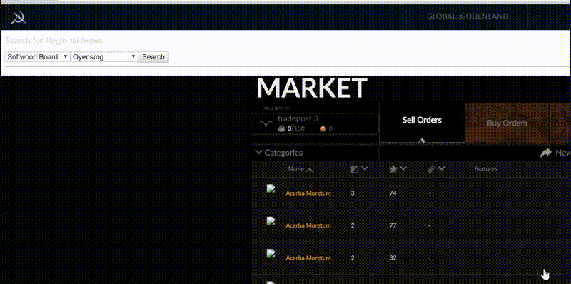

# What's this?

`lif-tp-seller` is a Google Chrome Extension that adds some basic functionality to search for regional items in the lifeisfeudal.com trading post.



# Installation

 - Get the .zip file of the latest Release from https://github.com/pherox-wurstmann/lif-tp-seller/releases
 - Unpack it
 - Open Google Chrome
 - Type `chrome://extensions` in the Address Bar
 - Enable `Developer Mode` in the top right Corner
 - Click `Load Unpacked Extension` 
 - Select the Directory where you've unpacked the .zip File to
 - Enjoy.

# License

```
           DO WHAT THE FUCK YOU WANT TO PUBLIC LICENSE
                   Version 2, December 2004
 
Copyright (C) 2004 Sam Hocevar <sam@hocevar.net>

Everyone is permitted to copy and distribute verbatim or modified
copies of this license document, and changing it is allowed as long
as the name is changed.
 
           DO WHAT THE FUCK YOU WANT TO PUBLIC LICENSE
  TERMS AND CONDITIONS FOR COPYING, DISTRIBUTION AND MODIFICATION

 0. You just DO WHAT THE FUCK YOU WANT TO.
```
